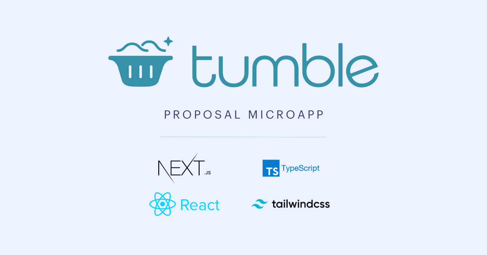

# Tumble Proposal Microapp 

<p align="center">
  </a>
</p>

🧺 Microapp for Tumble written in Next.js, Tailwind CSS and TypeScript


## Features

Developer experience first:

- [Next.js](https://nextjs.org) for Static Site Generator
- Integrate with [Tailwind CSS](https://tailwindcss.com) (w/ JIT mode)
- Linter with [ESLint](https://eslint.org) (default NextJS, NextJS Core Web Vitals and Airbnb configuration)
- Code Formatter with [Prettier](https://prettier.io)
- Husky for Git Hooks
- Reactplayer for video configuration
- VSCode configuration: Debug, Settings, Tasks and extension for PostCSS, ESLint, Prettier, TypeScript
- SEO metadata, JSON-LD and Open Graph tags with Next SEO
- One click deployment with Vercel 


## Components

- Banner
- Logo
- Features
- Banner
- Footer


## Requirements

- Node.js and npm

## Getting started

Run the following command on your local environment:

```
npm install
```

Then, you can run locally in development mode with live reload:

```
npm run dev
```

Open http://localhost:3000 with your favorite browser to see your project. For your information, Next JS need to take some time to compile the project for your first time.

```
.
├── README.md            # README file
├── next.config.js       # Next JS configuration
├── public               # Public folder
│   └── assets
│       └── images       # Image used by default template
├── src
│   ├── background       # Atomic background component
│   ├── button           # Atomic button component
│   ├── cta              # Atomic cta component
│   ├── feature          # Atomic feature component
│   ├── footer           # Atomic footer component
│   ├── hero             # Atomic hero component
│   ├── layout           # Atomic layout component
│   ├── navigation       # Atomic navigation component
│   ├── pages            # Next JS pages
│   ├── styles           # PostCSS style folder with Tailwind
│   ├── templates        # Default template
│   └── utils            # Utility folder
├── tailwind.config.js   # Tailwind CSS configuration
└── tsconfig.json        # TypeScript configuration
```

- the entry point: `index.tsx` in `src/pages`
- the `Base` template: `Base.tsx` in `src/templates`
- use component blocks from `src/templates/*`
- use atomic components from `src/*`

## Customization

### Video:
To embed a youtube video:
```jsx
import React from 'react'
import ReactPlayer from 'react-player'
// Render a YouTube video player instead of local file
<ReactPlayer url='https://www.youtube.com/watch?v=ysz5S6PUM-U' />
```

Otherwise embed from source in public folder.

### Client Config

AppConfig.ts customizes the following:

```
 site_name: 'Partnership with Company Name',
  title: 'Tumble Partnership.', 
  description: 'Our Proposal To you',
  locale: 'en',
  owner: 'Clarified Inc. DBA Tumble.',
```


See [react-player](https://github.com/cookpete/react-player) for more on video customizations


## Deploy to production

You can see the results locally in production mode with:

```
$ npm run build
$ npm run start
```

The generated HTML and CSS files are minified (built-in feature from Next js). It will also removed unused CSS from [Tailwind CSS](https://tailwindcss.com).

You can create an optimized production build with:

```
npm run build-prod
```

Now, your theme is ready to be deployed. All generated files are located at `out` folder, which you can deploy with any hosting service.


## Deploy to Vercel

Deploy this Next JS Boilerplate on Vercel in one click:

[](https://vercel.com/new/git/external?repository-url=https%3A%2F%2Fgithub.com%2Fixartz%2FNext-JS-Landing-Page-Starter-Template)

## VSCode information (optional)

If you are VSCode users, you can have a better integration with VSCode by installing the suggested extension in `.vscode/extension.json`. The starter code comes up with Settings for a seamless integration with VSCode. The Debug configuration is also provided for frontend and backend debugging experience.

Pro tips: if you need a project wide type checking with TypeScript, you can run a build with <kbd>Cmd</kbd> + <kbd>Shift</kbd> + <kbd>B</kbd> on Mac.


---

